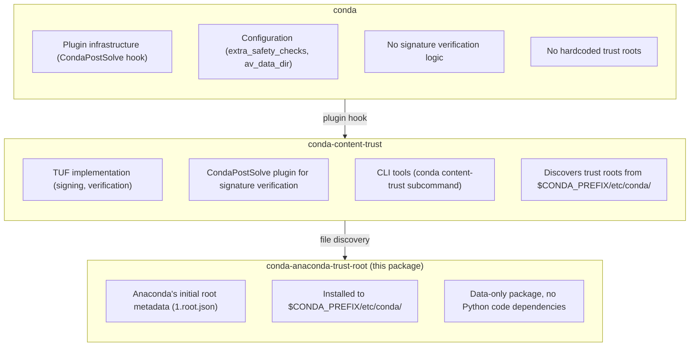

# conda Signature Verification Architecture

This document describes the architecture of conda's signature verification system and the rationale for the March 2026 migration to a modular plugin-based design.

## Summary

conda's signature verification infrastructure has been migrated from hardcoded components to a modular plugin-based architecture. The trust root metadata is now distributed via standalone packages (like `conda-anaconda-trust-root`), and verification logic lives in the `conda-content-trust` plugin.

This migration addresses long-standing concerns about hardcoded Anaconda-specific cryptographic keys in the conda OSS codebase while enabling other channels (conda-forge, community channels) to implement their own trust roots.

---

## Context and Problem Statement

### Historical Background

#### 2009: The Update Framework (TUF)

The Update Framework was developed to address widespread vulnerabilities in package managers. TUF provides a specification for securing software update systems against a comprehensive threat model, including compromised repositories, key compromise, and rollback attacks.

#### May 2021: Anaconda introduces conda signature verification

Anaconda [announced conda signature verification](https://www.anaconda.com/blog/conda-signature-verification), implementing TUF-based package signing for the Anaconda professional repository (repo.anaconda.cloud). Key aspects:

- Packages and metadata signed on Anaconda's secure build network
- Root metadata shipped with conda to establish chain of trust
- Multi-authority key management with offline root keys on hardware security devices
- Separation of root trust authority, key manager authority, and package verification authorities

#### November 2021: mamba implements compatible verification

QuantStack [implemented package signing in mamba](https://adelsalle.medium.com/towards-a-more-secure-conda-ecosystem-5ce65a27d7d5), ensuring compatibility with conda-content-trust. This implementation was funded by the Chan Zuckerberg Initiative as part of broader conda ecosystem security improvements.

#### December 2021: Community expansion announcement

Anaconda [announced collaboration](https://www.anaconda.com/blog/paving-the-way-for-community-innovation-with-security-features-for-signed-packages) with mamba and conda-forge teams to bring signature verification to open-source channels.

#### February 2025: Hardcoding concern raised

Issue [conda/conda#14577](https://github.com/conda/conda/issues/14577) formally raised the concern that Anaconda's root keys were hardcoded in conda's codebase, preventing other organizations from using signature verification without modifying conda itself.

> "I suppose that only Anaconda has the corresponding private keys, making them the only organization being able to create signatures that can be verified with an unmodified version of conda."
>
> — Sylvain Corlay, QuantStack

#### May 2025: Migration epic created

Tracking issue [conda/conda#14797](https://github.com/conda/conda/issues/14797) created to plan the migration of trust-related code out of conda.

### The Problem

The current architecture has several issues:

1. **Vendor Lock-in**: Hardcoded Anaconda root keys in `conda/trust/constants.py` mean only Anaconda-signed packages can be verified without patching conda.

2. **Separation of Concerns**: Anaconda-specific trust metadata does not belong in the conda OSS project.

3. **Extensibility**: Other channels (conda-forge, bioconda, community channels) cannot implement their own trust roots without conda modifications.

4. **Maintenance Burden**: Security-critical code tightly coupled to conda release cycles.

---

## Decision

### Architecture

We adopt a three-component architecture:



### Key Design Decisions

#### 1. Trust Root as Data Package

The trust root is distributed as a data-only package that installs JSON files to a well-known location (`$CONDA_PREFIX/etc/conda/`). This approach:

- Eliminates Python import dependencies between security-critical components
- Allows trust roots to be installed, updated, and removed independently
- Enables multiple trust roots from different providers to coexist
- Follows the principle of least privilege (data files, not executable code)

#### 2. File-Based Discovery

`conda-content-trust` discovers trust roots by scanning `context.av_data_dir` (defaults to `$CONDA_PREFIX/etc/conda/`) for `*.root.json` files. This:

- Avoids import-time dependencies
- Allows distributions (miniforge, miniconda) to pre-install appropriate trust roots
- Enables users to manually manage trust roots if needed

#### 3. No Fallback Trust Root

When no trust root is found on disk, signature verification is disabled rather than falling back to a built-in default. This:

- Makes the security posture explicit and auditable
- Prevents silent degradation of security guarantees
- Forces intentional installation of trust roots

#### 4. Plugin-Based Verification

Signature verification is implemented as a `CondaPostSolve` plugin hook, allowing:

- Optional installation (users who don't need verification can skip it)
- Independent release cycles from conda
- Easier security audits of isolated verification code

---

## Implementation

### Timeline

| Date | Milestone |
|------|-----------|
| 2025-05-02 | Migration epic created ([#14797](https://github.com/conda/conda/issues/14797)) |
| 2026-01-29 | Draft PRs opened for all three components |
| 2026-03 (target) | conda 26.3.0 release removes `conda.trust` module |
| 2026-03 (target) | conda-content-trust 0.3.0 release with verification plugin |
| 2026-03 (target) | conda-anaconda-trust-root initial release |

### Pull Requests

- **conda**: [#15649](https://github.com/conda/conda/pull/15649) — Remove `conda.trust` module
- **conda-content-trust**: [#245](https://github.com/conda/conda-content-trust/pull/245) — Add signature verification plugin
- **conda-anaconda-trust-root**: [#3](https://github.com/anaconda/conda-anaconda-trust-root/pull/3) — Trust root package

### Migration Path

For users currently relying on signature verification:

```bash
# Before (conda <= 26.1.x)
# Verification was built-in with hardcoded Anaconda trust root

# After (conda >= 26.3.0)
conda install conda-content-trust conda-anaconda-trust-root
# Verification now provided by plugin + external trust root
```

For distributions (miniforge, miniconda, etc.):

- Include `conda-anaconda-trust-root` (or appropriate trust root package) in base environment
- Users get signature verification automatically when `conda-content-trust` is installed

---

## Consequences

### Positive

1. **Decoupling**: Anaconda-specific trust data removed from conda OSS project
2. **Extensibility**: Other channels can create and distribute their own trust root packages
3. **Auditability**: Trust roots are explicit files on disk, not buried in source code
4. **Maintainability**: Security-critical code isolated in dedicated packages
5. **Compatibility**: No changes to TUF protocol or verification logic; mamba compatibility preserved

### Negative

1. **Additional Packages**: Users must install extra packages for signature verification
2. **Migration Effort**: Existing deployments need updates to maintain verification
3. **Discovery Complexity**: Trust root discovery is filesystem-based rather than import-based

### Risks and Mitigations

| Risk | Mitigation |
|------|------------|
| Users unaware of migration | Release notes, deprecation warnings in 26.1.x/26.2.x |
| Trust root not installed | Clear error messages when verification requested but no trust root found |
| Incompatible trust roots | TUF specification compliance ensures interoperability |

---

## Stakeholder Impact

### Anaconda Security Team

- **Action Required**: Review and approve trust root package structure
- **Ongoing**: Manage root key rotation via package updates

### QuantStack / mamba team

- **Impact**: None to mamba verification logic
- **Opportunity**: Can implement compatible trust root discovery in mamba
- **Reference**: This architecture aligns with [Sylvain's proposal](https://github.com/conda/conda/issues/14577) for configurable trust roots

### conda maintainers

- **Action Required**: Review and merge conda PR removing `conda.trust`
- **Ongoing**: Maintain plugin infrastructure for post-solve hooks

### conda-forge

- **Opportunity**: Can create `conda-forge-trust-root` package when ready to sign packages
- **No immediate action required**

### Distribution Maintainers (miniforge, etc.)

- **Action Required**: Include appropriate trust root packages in distributions
- **Timeline**: Before upgrading to conda 26.3.0

---

## References

### Blog Posts

- [Anaconda Content Trust: Conda Signature Verification](https://www.anaconda.com/blog/conda-signature-verification) (May 2021)
- [Paving the way for Community Innovation with Security Features](https://www.anaconda.com/blog/paving-the-way-for-community-innovation-with-security-features-for-signed-packages) (December 2021)
- [Towards a more secure conda ecosystem](https://adelsalle.medium.com/towards-a-more-secure-conda-ecosystem-5ce65a27d7d5) (November 2021, QuantStack)

### Specifications

- [The Update Framework (TUF)](https://theupdateframework.io/)
- [mamba artifacts verification](https://mamba.readthedocs.io/en/latest/advanced_usage/artifacts_verification.html)

### Issues

- [conda/conda#14577](https://github.com/conda/conda/issues/14577) — Hardcoding of conda content trust root keys
- [conda/conda#14797](https://github.com/conda/conda/issues/14797) — Migration tracking epic

### Packages

- [conda-content-trust](https://github.com/conda/conda-content-trust) — Signing and verification tools
- [conda-anaconda-trust-root](https://github.com/anaconda/conda-anaconda-trust-root) — Anaconda trust root metadata
